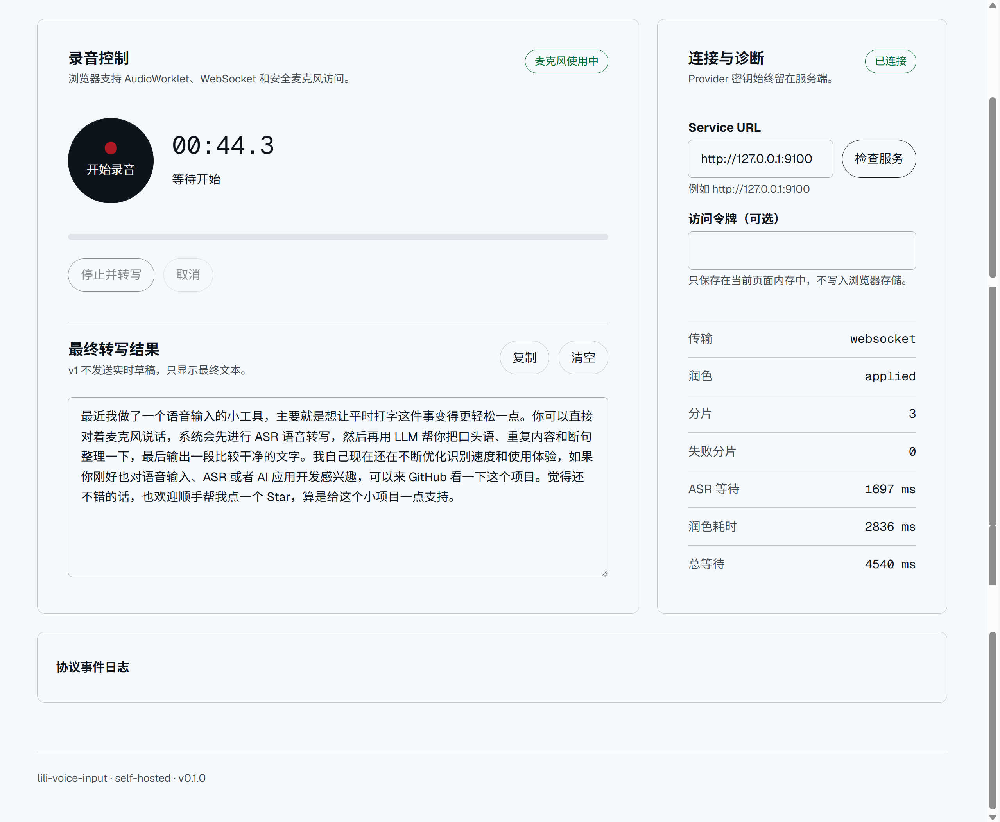
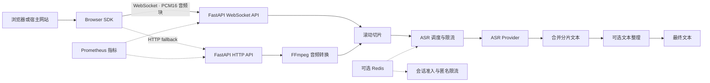

# lili-voice-input

一个可自托管、可嵌入网站的语音输入服务：浏览器分块发送麦克风音频，服务端完成 ASR 转写和可选文本整理，并在用户停止录音后返回最终文本。

> [!WARNING]
> 当前仓库尚未选择开源许可证。在添加 `LICENSE` 前，请勿将它作为正式公开版本发布。

## 演示效果



> 开发者工作台展示完整语音链路的连接状态、转写结果及各阶段耗时，方便接入方定位 ASR 和文本整理环节的性能瓶颈。

| 操作 | 页面表现 |
| --- | --- |
| 检查服务 | 验证服务端、Provider、FFmpeg 和 Redis 是否就绪 |
| 开始录音 | 获取麦克风权限并持续发送 PCM16 音频块 |
| 停止并转写 | 等待 ASR 合并和可选文本整理 |
| 查看结果 | 显示最终文本、分片数量和各阶段耗时 |
| 查看诊断 | 显示连接、排队、转写和降级事件 |

```text
用户口述
  ↓
录音期间分块上传
  ↓
服务端滚动切片并提前执行 ASR
  ↓
停止录音后合并转写
  ↓
可选文本整理
  ↓
返回最终文本
```

> v1 不发送实时草稿，只在录音结束后返回最终文本。

## 核心功能

- FastAPI HTTP 与 WebSocket API
- TypeScript Browser SDK，支持 ESM 和普通 `<script>` 标签
- 浏览器录音、PCM16 分块传输和 AudioWorklet
- WebSocket 异常时的一次 HTTP 上传降级
- DashScope、OpenRouter 和 SiliconFlow ASR Provider
- OpenAI-compatible 文本整理 Provider
- 文本整理失败时保留原始 ASR 结果，不丢失已完成转写
- 匿名短期令牌、Origin 校验和服务端密钥隔离
- 会话准入队列、ASR 队列及分阶段并发限制
- 可选 Redis 跨实例配额协调
- Prometheus 指标、健康检查和 k6 负载测试
- 内置开发者工作台、API 文档和接入示例

## 快速开始

### 环境要求

- Python 3.12
- Node.js 20 或更高版本
- [uv](https://docs.astral.sh/uv/)
- FFmpeg

### 1. 配置环境变量

在项目根目录执行：

```powershell
Copy-Item .env.example .env
```

编辑 `.env`，至少填写 ASR Provider 配置：

```env
ASR_PROVIDER=dashscope
ASR_API_KEY=你的_API_Key
ASR_MODEL=qwen-audio-3.0-asr-flash-filetrans
```

如果暂时不使用文本整理：

```env
POLISH_ENABLED=false
```

如果启用文本整理，还需要填写：

```env
POLISH_ENABLED=true
POLISH_API_KEY=你的_API_Key
POLISH_BASE_URL=https://api.openai.com/v1
POLISH_MODEL=gpt-4.1-mini
```

Provider 密钥只能保存在服务端，不能写入浏览器代码。

### 2. 启动服务端

```powershell
Set-Location server
uv sync
uv run uvicorn lili_voice_input.main:app --host 127.0.0.1 --port 9100 --reload
```

### 3. 启动开发者工作台

另开一个终端，在项目根目录执行：

```powershell
npm install
npm run dev
```

打开以下地址：

- 开发者工作台：`http://127.0.0.1:5173/demo/`
- API 文档：`http://127.0.0.1:9100/docs`
- 就绪检查：`http://127.0.0.1:9100/health/ready`

### 4. 接入网站

```ts
import { VoiceInputClient } from "@lili-voice-input/browser";

const client = new VoiceInputClient({
  wsUrl: "ws://127.0.0.1:9100/v1/transcriptions/stream",
  fallbackUrl: "http://127.0.0.1:9100/v1/transcriptions",
  workletUrl: "http://127.0.0.1:9100/sdk/pcm-worklet.js",
});

client.on("final", ({ text }) => {
  document.querySelector("textarea").value = text;
});

await client.start();

// 用户点击停止时
await client.stop();
```

SDK 只负责采集、传输和返回结果。最终文本是覆盖、插入还是追加到输入框，由接入网站决定。

## 架构说明



### 处理流程

1. Browser SDK 获取麦克风权限。
2. 浏览器以 16kHz PCM16 格式发送音频块。
3. 服务端滚动切片并将任务交给 ASR 调度器。
4. ASR 调度器控制本地及可选的全局并发。
5. 所有分片完成后合并转写文本。
6. 如果启用文本整理，执行一次普通文本模型调用。
7. 服务端返回最终文本和各阶段耗时。
8. 如果文本整理失败，返回原始合并转写并标记降级原因。

## 部署方法

### 单实例 Docker 部署

```powershell
Copy-Item .env.example .env
# 编辑 .env，填写 Provider 配置

docker compose up --build -d
```

部署完成后访问：

- 开发者工作台：`http://127.0.0.1:9100/demo/`
- API 文档：`http://127.0.0.1:9100/docs`
- 存活检查：`http://127.0.0.1:9100/health/live`
- 就绪检查：`http://127.0.0.1:9100/health/ready`
- Prometheus 指标：`http://127.0.0.1:9100/metrics`

停止服务：

```powershell
docker compose down
```

### 公开网站接入

公开浏览器调用建议配置：

```env
ALLOWED_ORIGINS=https://your-site.example
ANONYMOUS_TOKENS_ENABLED=true
ANONYMOUS_TOKEN_SECRET=至少32字节的随机字符串
```

SDK 会通过 `/v1/anonymous-tokens` 获取短期令牌，Provider API Key 始终保留在服务端。

生产环境还应：

- 在服务前配置 HTTPS 反向代理
- 使用 `wss://` WebSocket 地址
- 严格限制 `ALLOWED_ORIGINS`
- 使用 `/health/ready` 作为负载均衡健康检查
- 多实例部署时启用 Redis
- 根据 Provider 配额设置会话和请求并发
- 监控 `/metrics` 中的错误率、排队时间和最终响应耗时

详细资料：

- [浏览器接入](docs/browser-integration.md)
- [API 协议](docs/protocol.md)
- [Provider 适配](docs/provider-adapters.md)
- [部署与容量](docs/deployment.md)
- [故障排查](docs/troubleshooting.md)
